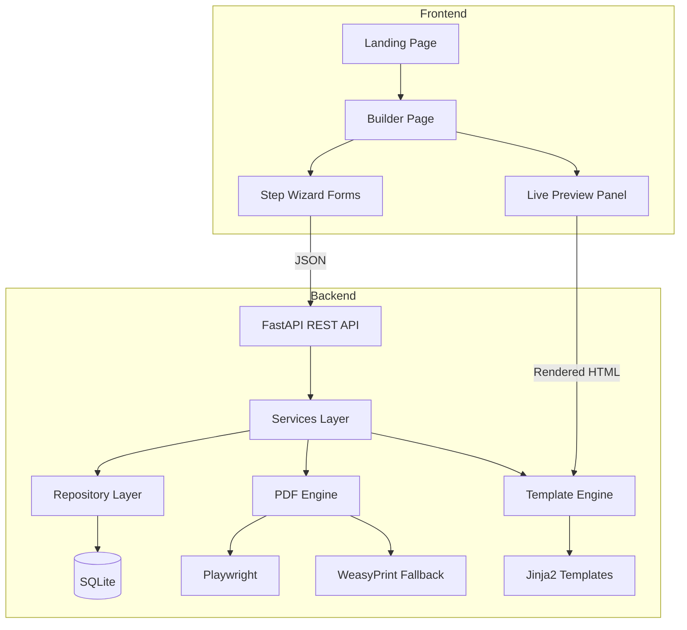

# Professional Resume Builder — Implementation Plan

## Overview

Build a production-quality Resume Builder SaaS application using **FastAPI + Jinja2 + Vanilla JS** with **Playwright/WeasyPrint** PDF generation and **SQLite/SQLAlchemy** storage. The app will feature a premium UI with live preview, step wizard, auto-save, and ATS-friendly templates.

---

## Architecture



---

## Proposed Changes

### Phase 1: Project Foundation (~15 files)

#### [NEW] [requirements.txt](file:///d:/My_products/Automated_CV_Generator/requirements.txt)
All Python dependencies: FastAPI, uvicorn, SQLAlchemy, Alembic, Pydantic, Jinja2, Playwright, WeasyPrint, python-multipart, aiofiles, etc.

#### [NEW] [.env.example](file:///d:/My_products/Automated_CV_Generator/.env.example)
Environment variable template.

#### [NEW] [Dockerfile](file:///d:/My_products/Automated_CV_Generator/Dockerfile)
Production Docker image with Playwright + Chromium.

#### [NEW] [docker-compose.yml](file:///d:/My_products/Automated_CV_Generator/docker-compose.yml)
Development and production compose setup.

#### [NEW] [README.md](file:///d:/My_products/Automated_CV_Generator/README.md)
Full project documentation.

---

### Phase 2: Backend Core (~12 files)

#### [NEW] [app/\_\_init\_\_.py](file:///d:/My_products/Automated_CV_Generator/app/__init__.py)
#### [NEW] [app/main.py](file:///d:/My_products/Automated_CV_Generator/app/main.py)
FastAPI application factory with CORS, static files, exception handlers.

#### [NEW] [app/core/config.py](file:///d:/My_products/Automated_CV_Generator/app/core/config.py)
Settings via Pydantic BaseSettings.

#### [NEW] [app/core/database.py](file:///d:/My_products/Automated_CV_Generator/app/core/database.py)
SQLAlchemy async engine + session factory.

#### [NEW] [app/core/security.py](file:///d:/My_products/Automated_CV_Generator/app/core/security.py)
Input sanitization, HTML escaping, XSS prevention utilities.

---

### Phase 3: Database Models & Schemas (~8 files)

#### [NEW] [app/models/base.py](file:///d:/My_products/Automated_CV_Generator/app/models/base.py)
SQLAlchemy declarative base with common mixins (timestamps, UUID PK).

#### [NEW] [app/models/user.py](file:///d:/My_products/Automated_CV_Generator/app/models/user.py)
User model (optional auth support).

#### [NEW] [app/models/resume.py](file:///d:/My_products/Automated_CV_Generator/app/models/resume.py)
Resume + all related models: Education, Experience, Project, Skill, Language, Certificate, Award, Volunteer, Reference.

#### [NEW] [app/schemas/resume.py](file:///d:/My_products/Automated_CV_Generator/app/schemas/resume.py)
Pydantic schemas for all resume data (create/update/response).

#### [NEW] [app/schemas/user.py](file:///d:/My_products/Automated_CV_Generator/app/schemas/user.py)
User Pydantic schemas.

---

### Phase 4: Repository & Service Layers (~6 files)

#### [NEW] [app/repositories/resume_repository.py](file:///d:/My_products/Automated_CV_Generator/app/repositories/resume_repository.py)
CRUD operations for resumes and all sub-entities.

#### [NEW] [app/services/resume_service.py](file:///d:/My_products/Automated_CV_Generator/app/services/resume_service.py)
Business logic: create, update, validate, auto-save resumes.

#### [NEW] [app/services/pdf_service.py](file:///d:/My_products/Automated_CV_Generator/app/services/pdf_service.py)
PDF generation via Playwright (primary) + WeasyPrint (fallback).

#### [NEW] [app/services/template_service.py](file:///d:/My_products/Automated_CV_Generator/app/services/template_service.py)
Template rendering via Jinja2 with dynamic section visibility.

---

### Phase 5: API Routes (~4 files)

#### [NEW] [app/api/routes.py](file:///d:/My_products/Automated_CV_Generator/app/api/routes.py)
REST endpoints: resume CRUD, preview, PDF download, template list.

#### [NEW] [app/api/pages.py](file:///d:/My_products/Automated_CV_Generator/app/api/pages.py)
Page-serving routes (landing, builder, etc.).

#### [NEW] [app/api/deps.py](file:///d:/My_products/Automated_CV_Generator/app/api/deps.py)
Dependency injection (DB session, services).

---

### Phase 6: Resume Templates (~3 files)

#### [NEW] [app/templates/resume_templates/modern/template.html](file:///d:/My_products/Automated_CV_Generator/app/templates/resume_templates/modern/template.html)
Primary ATS-friendly template — clean, professional, tech-company ready. Jinja2 template with embedded CSS for PDF rendering.

#### [NEW] [app/templates/resume_templates/modern/styles.css](file:///d:/My_products/Automated_CV_Generator/app/templates/resume_templates/modern/styles.css)
Template-specific styles with print media queries, auto page-break, font embedding.

#### [NEW] [app/templates/resume_templates/base.html](file:///d:/My_products/Automated_CV_Generator/app/templates/resume_templates/base.html)
Base template with common structure, font loading, page setup.

---

### Phase 7: Frontend — Landing Page (~3 files)

#### [NEW] [app/frontend/index.html](file:///d:/My_products/Automated_CV_Generator/app/frontend/index.html)
Premium landing page with hero, features, how-it-works, CTA.

#### [NEW] [app/frontend/static/css/landing.css](file:///d:/My_products/Automated_CV_Generator/app/frontend/static/css/landing.css)
Landing page styles — glassmorphism, gradients, animations.

#### [NEW] [app/frontend/static/js/landing.js](file:///d:/My_products/Automated_CV_Generator/app/frontend/static/js/landing.js)
Landing page interactions, scroll animations, navigation.

---

### Phase 8: Frontend — Design System (~3 files)

#### [NEW] [app/frontend/static/css/variables.css](file:///d:/My_products/Automated_CV_Generator/app/frontend/static/css/variables.css)
CSS custom properties: colors, spacing, typography, shadows, radii, breakpoints.

#### [NEW] [app/frontend/static/css/base.css](file:///d:/My_products/Automated_CV_Generator/app/frontend/static/css/base.css)
Reset, typography, utility classes, accessibility.

#### [NEW] [app/frontend/static/css/components.css](file:///d:/My_products/Automated_CV_Generator/app/frontend/static/css/components.css)
Reusable component styles: buttons, inputs, cards, modals, tooltips, tags, steppers.

---

### Phase 9: Frontend — Builder Page (~6 files)

#### [NEW] [app/frontend/builder.html](file:///d:/My_products/Automated_CV_Generator/app/frontend/builder.html)
Split-panel builder layout with form + live preview.

#### [NEW] [app/frontend/static/css/builder.css](file:///d:/My_products/Automated_CV_Generator/app/frontend/static/css/builder.css)
Builder layout, split panes, responsive collapse.

#### [NEW] [app/frontend/static/js/app.js](file:///d:/My_products/Automated_CV_Generator/app/frontend/static/js/app.js)
Main application entry point, router, state management.

#### [NEW] [app/frontend/static/js/store.js](file:///d:/My_products/Automated_CV_Generator/app/frontend/static/js/store.js)
Centralized state management with reactive updates, auto-save to localStorage + API.

#### [NEW] [app/frontend/static/js/api.js](file:///d:/My_products/Automated_CV_Generator/app/frontend/static/js/api.js)
API client for all backend calls.

#### [NEW] [app/frontend/static/js/preview.js](file:///d:/My_products/Automated_CV_Generator/app/frontend/static/js/preview.js)
Live preview renderer — fetches rendered template HTML and injects into preview iframe. Debounced updates on every state change.

---

### Phase 10: Frontend — Form Components (~8 files)

#### [NEW] [app/frontend/static/js/components/stepper.js](file:///d:/My_products/Automated_CV_Generator/app/frontend/static/js/components/stepper.js)
Animated step wizard with progress, validation gates.

#### [NEW] [app/frontend/static/js/components/personal-info.js](file:///d:/My_products/Automated_CV_Generator/app/frontend/static/js/components/personal-info.js)
Personal information form with photo upload, floating labels.

#### [NEW] [app/frontend/static/js/components/summary.js](file:///d:/My_products/Automated_CV_Generator/app/frontend/static/js/components/summary.js)
Professional summary textarea with character counter.

#### [NEW] [app/frontend/static/js/components/education.js](file:///d:/My_products/Automated_CV_Generator/app/frontend/static/js/components/education.js)
Education section — dynamic cards, add/remove/reorder.

#### [NEW] [app/frontend/static/js/components/experience.js](file:///d:/My_products/Automated_CV_Generator/app/frontend/static/js/components/experience.js)
Experience section — dynamic cards with bullet point editor.

#### [NEW] [app/frontend/static/js/components/projects.js](file:///d:/My_products/Automated_CV_Generator/app/frontend/static/js/components/projects.js)
Projects section — technology tags, links.

#### [NEW] [app/frontend/static/js/components/skills.js](file:///d:/My_products/Automated_CV_Generator/app/frontend/static/js/components/skills.js)
Skills section — categorized tag input with autocomplete.

#### [NEW] [app/frontend/static/js/components/additional.js](file:///d:/My_products/Automated_CV_Generator/app/frontend/static/js/components/additional.js)
Languages, Certifications, Awards, Volunteer, References — combined into one component with tabs.

---

### Phase 11: Frontend — Template Selection & Download (~3 files)

#### [NEW] [app/frontend/static/js/components/template-selector.js](file:///d:/My_products/Automated_CV_Generator/app/frontend/static/js/components/template-selector.js)
Template gallery with thumbnails, selection, and preview.

#### [NEW] [app/frontend/static/js/components/review.js](file:///d:/My_products/Automated_CV_Generator/app/frontend/static/js/components/review.js)
Review step — final summary of all sections, edit links.

#### [NEW] [app/frontend/static/js/components/download.js](file:///d:/My_products/Automated_CV_Generator/app/frontend/static/js/components/download.js)
Download step — page size selection, PDF generation, download button.

---

### Phase 12: Frontend Utilities (~3 files)

#### [NEW] [app/frontend/static/js/utils/validation.js](file:///d:/My_products/Automated_CV_Generator/app/frontend/static/js/utils/validation.js)
Client-side validation: email, phone, URLs, dates, required fields.

#### [NEW] [app/frontend/static/js/utils/drag-drop.js](file:///d:/My_products/Automated_CV_Generator/app/frontend/static/js/utils/drag-drop.js)
Drag-and-drop reordering utility.

#### [NEW] [app/frontend/static/js/utils/helpers.js](file:///d:/My_products/Automated_CV_Generator/app/frontend/static/js/utils/helpers.js)
Debounce, throttle, format date, sanitize HTML, generate UUID.

---

### Phase 13: Alembic Migrations (~3 files)

#### [NEW] [alembic.ini](file:///d:/My_products/Automated_CV_Generator/alembic.ini)
#### [NEW] [alembic/env.py](file:///d:/My_products/Automated_CV_Generator/alembic/env.py)
#### [NEW] [alembic/versions/001_initial.py](file:///d:/My_products/Automated_CV_Generator/alembic/versions/001_initial.py)

---

### Phase 14: Tests (~4 files)

#### [NEW] [tests/test_schemas.py](file:///d:/My_products/Automated_CV_Generator/tests/test_schemas.py)
Pydantic schema validation tests.

#### [NEW] [tests/test_api.py](file:///d:/My_products/Automated_CV_Generator/tests/test_api.py)
API endpoint integration tests.

#### [NEW] [tests/test_pdf.py](file:///d:/My_products/Automated_CV_Generator/tests/test_pdf.py)
PDF generation tests.

#### [NEW] [tests/conftest.py](file:///d:/My_products/Automated_CV_Generator/tests/conftest.py)
Pytest fixtures, test database, test client.

---

## Key Design Decisions

> [!IMPORTANT]
> **Live Preview Strategy**: The preview panel will use an `<iframe>` that receives server-rendered HTML from the `/api/preview` endpoint. On each form change (debounced ~300ms), the current state is POSTed to the server, which renders the Jinja2 template and returns HTML. This ensures the preview is pixel-identical to the final PDF.

> [!IMPORTANT]
> **PDF Generation**: Playwright (headless Chromium) is the primary PDF engine for pixel-perfect output. WeasyPrint serves as a lighter fallback. Both render the same Jinja2 HTML template.

> [!IMPORTANT]
> **State Management**: A simple reactive store pattern in vanilla JS. All form components read/write to the store. The store auto-saves to `localStorage` every 3 seconds and syncs to the API when a resume ID exists. The preview subscribes to store changes.

> [!NOTE]
> **Template Architecture**: Each template is a self-contained directory with `template.html` + `styles.css`. Templates use Jinja2 with a standardized data contract (the resume schema). New templates can be added by creating a new directory — no code changes needed.

---

## Open Questions

> [!IMPORTANT]
> **Font Choice**: I plan to use **Inter** (headings) and **Source Sans 3** (body) for the resume templates, and **Inter** for the application UI. These are professional, ATS-friendly fonts available via Google Fonts. Shall I proceed with these, or do you have a preference?

> [!IMPORTANT]
> **Authentication**: The spec mentions "optional user accounts." For the MVP, I'll implement localStorage-only storage with the database schema ready for auth. Should I also implement basic email/password auth in this first pass, or defer it?

> [!IMPORTANT]
> **Photo Upload**: Should the photo be stored as a base64 data URI (simpler, works with localStorage) or uploaded to the server filesystem? I recommend base64 for the MVP since it simplifies the preview pipeline.

---

## Verification Plan

### Automated Tests
```bash
# Run all tests
pytest tests/ -v

# Run specific test suites
pytest tests/test_schemas.py -v
pytest tests/test_api.py -v
pytest tests/test_pdf.py -v
```

### Manual Verification
1. Start the dev server: `uvicorn app.main:app --reload`
2. Visit landing page → verify premium design, responsive layout, animations
3. Click "Build Resume" → verify builder loads with split layout
4. Fill each form step → verify validation, auto-save, live preview updates
5. Select template → verify template preview
6. Download PDF → verify professional formatting, page breaks, fonts
7. Refresh page → verify auto-save restoration
8. Test on mobile viewport → verify responsive layout

---

## File Count Summary

| Phase | Files | Description |
|-------|-------|-------------|
| 1. Foundation | 5 | Config, Docker, docs |
| 2. Backend Core | 5 | FastAPI app, config, DB, security |
| 3. Models & Schemas | 5 | SQLAlchemy models, Pydantic schemas |
| 4. Repo & Services | 4 | Business logic, PDF, templates |
| 5. API Routes | 3 | REST + page routes |
| 6. Resume Templates | 3 | Modern ATS template |
| 7. Landing Page | 3 | HTML, CSS, JS |
| 8. Design System | 3 | CSS variables, base, components |
| 9. Builder Page | 6 | Layout, state, API client, preview |
| 10. Form Components | 8 | All form sections |
| 11. Template & Download | 3 | Selection, review, download |
| 12. Utilities | 3 | Validation, drag-drop, helpers |
| 13. Migrations | 3 | Alembic setup |
| 14. Tests | 4 | Unit + integration tests |
| **Total** | **~58 files** | |

Estimated implementation: **~8-10 responses** to complete all files.
